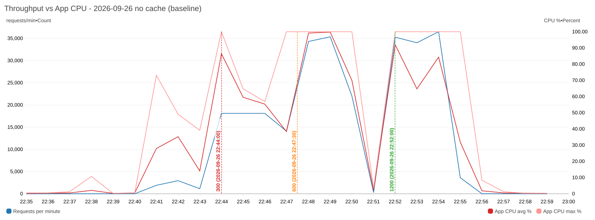
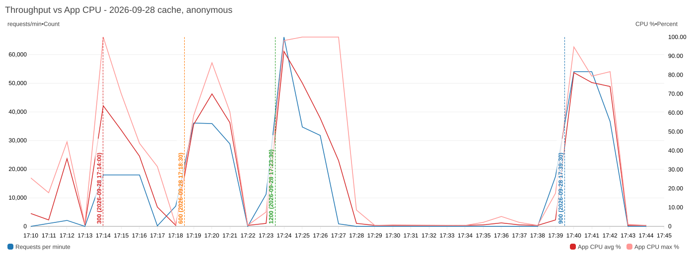
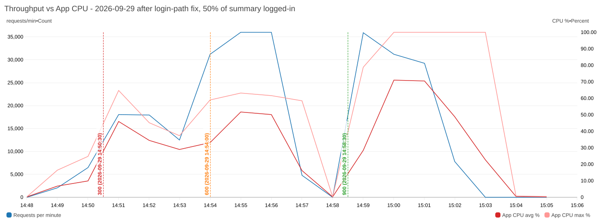
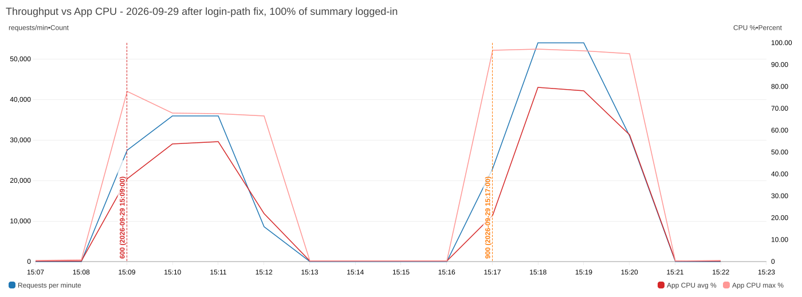

# 부하·정합성 검증

- `verify.sql` — 배치 정합성 불변식을 실제 MySQL에서 확인한다. 자동 테스트(`MatchRoundBatchInvariantTest`)와 같은 규칙이며,
  1절의 `violations`가 모두 0이어야 한다. 2절은 회차별 요약(풀·매칭·미매칭·쌍·평균 점수·이월·배치 지연)으로 측정 기록용이다.

- `dbsql.sh` — 아래 SQL 파일들을 운영 RDS에서 파일 그대로 실행하고 결과를 출력한다(붙여넣기 불필요).
- `token.sh` — 운영자 `access_token`을 직접 서명해 출력한다(지표 수집용 쿠키가 2시간마다 만료되므로).
- `reset-rounds.sql` — ⚠ 회차를 처음 상태로 되돌린다. 모든 신청·매칭이 지워지므로 측정·리허설 뒤 복구용으로만.
- `db-roundtrips.sh` — 요청 한 건이 DB를 몇 번 왕복하는지 센다(로컬 전용, MySQL general log). 응답 시간으로는 안 보이는 비용을 찾는다.
- `cloudwatch.py` — 측정 구간의 CloudWatch 지표를 분 단위 표나 PNG 그래프(`graphs/`)로 뽑는다. 읽기 전용이고 시각은 KST.
  1분 단위 데이터는 15일만 보관되므로 측정한 주에 뽑아 둔다.
- `sample.sql` — 매칭 결과를 눈으로 읽는다. 참가자 속성, 쌍별 점수 근거(공통 태그 수·같은 공연·나이대), 파트너 수 분포, 미매칭자.
  개인정보라 `instagram_id`는 뽑지 않는다.

```bash
# 로컬. -p와 비밀번호는 반드시 붙여 쓴다(-p yufesta 처럼 띄우면 yufesta가 DB 이름이 되고,
# 파일을 stdin으로 넣은 상태라 비밀번호 프롬프트를 읽지 못해 Access denied가 난다)
docker compose exec -T mysql mysql --default-character-set=utf8mb4 -uroot -pyufesta yufesta < load/verify.sql
docker compose exec -T mysql mysql --default-character-set=utf8mb4 -uroot -pyufesta yufesta < load/sample.sql

# 비밀번호를 바꿨다면 .env의 MYSQL_ROOT_PASSWORD 값을 -p 뒤에 붙인다
# 운영: infra/README.md 3-1의 dbshell로 붙은 mysql> 프롬프트에 파일 내용을 붙여넣는다
```

실행 시점: 배치(`close`) 직후, 발표(`publish`) 직후, 리허설 종료 후, 부하 테스트 종료 후.

눈으로 확인하는 또 다른 방법은 `MatchRoundBatchInvariantTest`의 "무작위 20명" 테스트다. 참가자 속성과 쌍별 점수 근거를 로그로 찍는다.

```bash
./gradlew test --tests '*MatchRoundBatchInvariantTest' -i | grep -A40 '── 참가자'
```

## 부하 테스트 (k6)

실사용자가 없는 기간에만, 운영 환경을 대상으로 돌린다. 로컬은 RDS·ALB·Fargate CPU 제한이 빠져 병목 위치를 못 잡는다.
도착률 기반(arrival-rate) 시나리오라 서버가 느려져도 부하가 줄지 않아 한계가 드러난다.

| 파일 | 유형 | 무엇을 보나 |
|---|---|---|
| `scenarios/smoke.js` | 연기 | 스크립트·토큰·엔드포인트가 동작하는지(항상 먼저) |
| `scenarios/read-mix.js` | 평균·장시간 | 당일 읽기 믹스. `RATE`·`DURATION`으로 load(300 req/s 10분)와 soak(150 req/s 30분) 겸용 |
| `scenarios/publish-spike.js` | 스파이크 | 발표 직후 1,000명 결과 조회 + 홈 폴링(NFR-PF-01) |
| `scenarios/stress.js` | 스트레스 | 300→600→1,200→2,400 req/s. 임계값이 처음 깨지는 지점 |
| `scenarios/breakpoint.js` | 한계점 | 결과 조회만 올려 한계 처리량. Redis 캐시 판단 근거 |
| `scenarios/write-apply.js` | 쓰기 | 마감 직전 신청 폭주. 유니크 제약·잠금 경합 |

### 준비

```bash
export AWS_PROFILE=yufesta
export BASE_URL=https://api.yufesta.com
export JWT_SECRET=$(aws ssm get-parameter --name /yufesta/prod/JWT_SECRET --with-decryption --query 'Parameter.Value' --output text)
```

비밀은 셸 변수로만 둔다(파일·git에 남기지 않는다). 터미널을 닫으면 사라진다.

### 세션으로 나눠 진행

한 번에 몰아서 하지 않는다. 세션마다 필요한 "회차 상태"만 맞으면 독립적으로 다시 돌릴 수 있고,
중간에 실패해도 그 세션만 반복하면 된다. 시작 전·후에 `status.sql`로 지금 상태를 확인한다.

SQL은 `dbsql.sh`로 **파일 그대로** 실행한다. 일회성 Fargate 태스크에 파일 내용을 넘겨 돌리고 결과를 CloudWatch 로그에서 받아오므로,
dbshell 프롬프트에 수십 줄을 붙여넣다 실패할 일이 없다(태스크는 끝나면 스스로 종료된다).

```bash
export AWS_PROFILE=yufesta
./load/dbsql.sh load/status.sql      # 지금 상태 (합성 회원 수, 회차, 세션별 준비 여부)
./load/dbsql.sh load/seed.sql        # 합성 회원 1,000명 + 신청
./load/dbsql.sh load/verify.sql      # 정합성 위반 0 확인
./load/dbsql.sh load/cleanup.sql     # 정리

# 로컬은 그대로 파이프
docker compose exec -T mysql mysql --default-character-set=utf8mb4 -uroot -pyufesta yufesta < load/status.sql
```

직접 쿼리를 두드려야 할 때만 대화형 dbshell(`infra/README.md` 3-1)을 쓴다.

공통 환경 변수는 세션마다 다시 export 한다(터미널을 새로 열면 사라진다).
k6는 export된 환경변수를 그대로 읽으므로 `-e` 플래그를 붙이지 않아도 된다.

```bash
export AWS_PROFILE=yufesta
export BASE_URL=https://api.yufesta.com
export JWT_SECRET=$(aws ssm get-parameter --name /yufesta/prod/JWT_SECRET --with-decryption --query 'Parameter.Value' --output text)
export USER_ID_FROM=<status.sql의 min_user_id>
export USER_COUNT=1000
echo "$BASE_URL / secret ${#JWT_SECRET}바이트 / from $USER_ID_FROM"   # 값이 비어 있지 않은지 확인
```

명령을 `K6="k6 run …"` 처럼 변수에 담아 `$K6`로 실행하지 말 것. zsh는 bash와 달리 변수를 단어로 쪼개지 않아
전체가 하나의 명령 이름이 되고 `command not found`가 난다.

| 세션 | 필요한 상태 | 하는 일 | 소요 | 실패하면 |
|---|---|---|---|---|
| **A. 준비·쓰기** | 회차 OPEN | `seed.sql` → `smoke.js` → `write-apply.js`(동시 50·200 비교) | 8분 | A만 다시 |
| **B. 배치·발표** | A 완료, 회차 OPEN | `close` 시간 측정 → `verify.sql` → `publish` → `publish-spike.js` | 10분 | 회차 초기화 후 A부터 |
| **C. 평균 부하** | 시드 | `read-mix.js` (300 req/s 10분) | 10분 | C만 다시 |
| **D. 한계 탐색** | 시드, B 완료(결과 조회) | `stress.js` → `breakpoint.js` | 30분 | 해당 시나리오만 다시 |
| **E. 복원력** | 시드 | `read-mix.js` 도는 중 태스크 종료·RDS 장애 조치·스케줄러 확인 | 15분 | E만 다시 |
| **F. 장시간** | 시드 | `read-mix.js -e RATE=150 -e DURATION=30m` | 30분 | 생략 가능 |
| **G. 정리** | - | `cleanup.sql` → 회차 초기화 → `verify.sql` | 3분 | 반드시 실행 |

가장 값진 건 **A·B·C**(25분)다. 여기서 NFR-PF-01(발표 스파이크)과 NFR-PF-03(배치 시간), 평상시 여유를 얻는다.
D는 한계와 Redis 판단, E는 당일 장애 대응, F는 누수 확인용이라 시간이 날 때 따로 해도 된다.

**세션 A — 준비와 쓰기 부하** (회차가 OPEN이어야 한다)

```bash
# 1) 시드 → 출력된 min_user_id 메모
./load/dbsql.sh load/seed.sql
# 2) 스크립트·토큰 확인
k6 run load/scenarios/smoke.js
# 3) 마감 직전 신청 폭주(유니크 제약·잠금 경합). 대부분 409(이미 신청)가 정상이다.
#    지표 수집(collect-metrics.sh)을 켠 상태로 동시 실행 수를 바꿔 두 번 돌려 비교한다
k6 run load/scenarios/write-apply.js                    # 동시 50 (현실적인 마감 직전)
CONCURRENCY=200 k6 run load/scenarios/write-apply.js    # 동시 200 (최악, 썬더링 허드)
```

**세션 B — 배치와 발표 스파이크** (여기서 회차가 PUBLISHED로 바뀐다)

```bash
# 1) 지표 수집 시작(다른 터미널). 운영자 access_token 쿠키 값이 필요하다
BASE_URL=$BASE_URL ACCESS_TOKEN=<쿠키> ./load/collect-metrics.sh sessionB.csv
# 2) 운영자 Swagger 또는 curl로 마감 → 응답까지 걸린 시간과 로그의 "배치: 풀 N명, M쌍" 기록(NFR-PF-03)
#    POST /api/v1/admin/match/rounds/{id}/close
# 3) ./load/dbsql.sh load/verify.sql 로 위반 0 확인
# 4) 발표 후 곧바로 스파이크(발표 직후 1,000명 결과 조회, NFR-PF-01)
#    POST /api/v1/admin/match/rounds/{id}/publish
ulimit -n 10240
k6 run load/scenarios/publish-spike.js
```

**세션 C~F**

```bash
k6 run load/scenarios/read-mix.js                          # C. 평균 300 req/s 10분
k6 run load/scenarios/breakpoint.js                        # D. 결과 조회 한계점(임계값 깨지면 자동 중단)
RATE=150 DURATION=30m k6 run load/scenarios/read-mix.js    # F. soak

# D. 한계 탐색은 단계를 나눠 돌린다. stress.js는 한 번에 올리지만 k6 요약이 전체 집계라
# "어느 단계에서 깨졌는지"를 알 수 없다. read-mix를 부하만 바꿔 3분씩 돌리면 단계별 요약이 따로 남는다
RATE=300  DURATION=3m k6 run load/scenarios/read-mix.js
RATE=600  DURATION=3m k6 run load/scenarios/read-mix.js
RATE=1200 DURATION=3m k6 run load/scenarios/read-mix.js
RATE=2400 DURATION=3m k6 run load/scenarios/read-mix.js
```

**세션 E — 복원력** (C의 `read-mix.js`가 도는 중에 실행)

```bash
# ① 태스크 1개 강제 종료 → k6 오류율·회복 시간, ALB HealthyHostCount
aws ecs list-tasks --cluster yufesta-cluster --service-name yufesta-api --query 'taskArns[0]' --output text
aws ecs stop-task --cluster yufesta-cluster --task <arn> --reason "resilience test" >/dev/null

# ② RDS 장애 조치(Multi-AZ) → 오류 창 길이. 1~2분 걸린다
aws rds reboot-db-instance --db-instance-identifier yufesta-mysql --force-failover >/dev/null

# ③ 스케줄러가 두 태스크에서 한 번만 전이하는지
aws logs tail /ecs/yufesta-api --follow --filter-pattern "회차"
```

**세션 G — 정리** (그날 작업을 끝낼 때 반드시)

```bash
# dbshell에서
#   cleanup.sql        합성 회원·신청·결과 삭제
#   reset-rounds.sql   회차를 SCHEDULED로 되돌리기(모든 신청·매칭이 지워진다. 내용 확인 후)
#   verify.sql         위반 0 확인
#   status.sql         합성 데이터 0, 회차 SCHEDULED 확인
```

세션을 나눠 여러 날에 걸쳐 할 때는 **그날 세션이 끝나면 G까지 하고 마친다.** 합성 회원을 남겨 두면 프론트 팀원이 보는 신청자 수가 부풀고,
회차가 PUBLISHED로 남으면 다음 세션 A(쓰기)를 못 한다.

### 주의사항 (실행 전 확인)

- **배포가 먼저**다. `/actuator/metrics`는 이 PR이 배포된 뒤에만 열린다(그전에는 404·403).
- **부하 중 배포·`terraform apply` 금지.** 태스크가 교체되면 측정이 섞인다.
- **파일 디스크립터**: 1,000 VU 이상을 쓰기 전에 `ulimit -n 10240`. 안 하면 "too many open files"가 난다.
- **클라이언트가 먼저 막힐 수 있다.** 2,400 req/s는 노트북의 TLS 처리와 회선을 먼저 소모한다.
  `http_req_connecting`·`tls_handshaking`이 커지거나 k6 프로세스 CPU가 100%면 서버가 아니라 이쪽 한계다. 그때 수치는 서버 판단에 쓰지 않는다.
- **알람 메일이 온다.** 스트레스 구간의 5xx와 태스크 종료 시 HealthyHostCount 알람이 SNS로 발송된다. 테스트 때문이니 놀라지 않아도 된다.
- **비용**: ALB LCU와 데이터 전송으로 1.5시간에 $1~2 수준.
- **토큰 만료는 걱정하지 않아도 된다.** 매 반복마다 새로 서명하며 유효 기간은 2시간이다. 다만 로컬 시계가 서버보다 1분 이상 빠르면 `exp` 검증이 어긋날 수 있으니 시계 자동 동기화는 켜 둔다.
- **회차 초기화 뒤 스케줄러가 1회차를 즉시 다시 연다**(`open_at`이 9/25 00:00로 이미 지났기 때문). 정상이다.

### 함께 볼 지표

- CloudWatch: ALB `TargetResponseTime`(p95)·`HTTPCode_Target_5XX_Count`·`RequestCount`, ECS `CPUUtilization`·`MemoryUtilization`, RDS `CPUUtilization`·`DatabaseConnections`
- `collect-metrics.sh` CSV: 힙 사용량, 프로세스 CPU, Hikari active/pending/idle, Tomcat busy/current, 요청 수·최대 응답 시간

### 병목 판독

| 증상 | 원인 | 조치 |
|---|---|---|
| ECS CPU 80%+ & p95 상승 | 앱 CPU(0.5 vCPU) 한계 | 태스크 수↑ 또는 1 vCPU |
| RDS CPU 80%+ 또는 `DatabaseConnections` 정체 | DB 병목 | 결과 조회 Redis 프리워밍, 쿼리 점검 |
| CPU 낮은데 p95 높고 `hikari_pending` > 0 | 커넥션 풀 대기 | 풀 크기↑ 또는 캐시 |
| `tomcat_busy`가 최대(200)에 붙음 | 스레드 포화 | 요청당 시간 단축(캐시), 태스크↑ |
| soak 중 힙 우상향 | 누수 | 힙 덤프 분석 |
| `/match/summary`가 트래픽의 대부분 | 폴링 자체가 부하 | SSE 전환 근거 |

### 한눈에 보는 개선 흐름

측정 → 병목 확인 → 한 가지만 변경 → 같은 조건으로 재측정을 반복했다. 자세한 수치와 판단 근거는 아래 각 절에 있다.

| 단계 | 측정에서 본 것 | 바꾼 것 | 결과 |
|---|---|---|---|
| 1 (09-25) | 발표 직후 1,000명: CPU 26%인데 Tomcat 스레드 200개가 전부 대기, 커넥션 대기 189 | DB 커넥션 풀 10 → 20 | `summary` p95 4,390 → 415 ms, 커넥션 대기 189 → 12 |
| 2 (09-26) | 처리량 천장 약 600 req/s. 앱 CPU 100%, RDS는 31% | 완성된 응답 문자열을 Redis에 캐시(#120), 홈 요약 공통부 캐시(#134) | 600 req/s에서 CPU 100% → 54~70%, 응답 1.6~3.0 s → 4~13 ms |
| 3 (09-28) | 로그인 요청이 20%뿐인데 용량이 3분의 1 감소. 로그인 요약 1건이 DB를 15회 왕복 | 회원 역할을 메모리에 기억, 내 상태를 쿼리 하나로·트랜잭션 없이(#138) | DB 왕복 15.3 → 1.0회. 로그인 50%·600 req/s에서 CPU 74~75% → 50~52%, DB 연결 40 → 18~20 |
| 남은 약점 | 900 req/s 부근에서 한계를 넘으면 급격히 무너진다(캐시 타임아웃 + 헬스체크 제외) | 미조치 | 예상 부하(70~200 req/s)의 4배 이상에서만 나타난다 |

### 결과 기록

| 날짜 | 시나리오 | 부하 | med / p90 / p95 | 오류율 | 비고 |
|---|---|---|---|---|---|
| 09-25 | A. smoke | 5 VU · 30 req/s · 1분 | 26 / 86 / 101 ms | 0% (1,824 체크 전부 통과) | 기준선. 공개 읽기 6종 + 쿠키 인증 2종 모두 정상, 최대 538ms |
| 09-25 | A. write-apply (콜드) | 동시 200 · 67 req/s | 2,070 / 4,010 / 4,740 ms | 0% | **첫 쓰기 부하**. JIT·쿼리 플랜·풀이 식은 상태 |
| 09-25 | A. write-apply (웜) | 동시 50 · 140 req/s | 303 / 616 / 721 ms | 0% | 현실적인 마감 직전. 임계값 통과 |
| 09-25 | A. write-apply (웜) | 동시 200 · 160 req/s | 935 / 1,780 / 1,910 ms | 0% | 같은 동시성인데 콜드 대비 p95 2.5배 개선 |
| 09-25 | B. 배치(close) | 1,001명 · 540쌍 | **8.6초** | - | NFR-PF-03(500명 30초) 통과. 정합성 12종 위반 0 |
| 09-25 | B. publish-spike `results/me` | 1,000 VU · 162 req/s | 376 / 2,890 / **3,760** ms | 0% | 임계값 1초 초과 |
| 09-25 | B. publish-spike `summary` | 5초 폴링 · 3분 20초 | 52 / 2,900 / **4,390** ms | 0% | 최대 16초. 5xx·타임아웃 0건 |
| 09-25 | **B2. 풀 20 재측정** `results/me` | 1,000 VU · 184 req/s | 142 / 559 / **668** ms | 0% | 임계값 통과(NFR-PF-01 달성) |
| 09-25 | **B2. 풀 20 재측정** `summary` | 5초 폴링 · 3분 20초 | 40 / 303 / **415** ms | 0% | 최대 1.59초 |

측정은 맥북에서 서울 리전까지 인터넷을 거친 값이라 네트워크 왕복이 포함돼 있다(최소 13.5ms).
서버 자체 처리 시간은 CloudWatch의 ALB `TargetResponseTime`과 비교해 가른다.

**쓰기 부하에서 읽은 것** (2026-09-25)

- 동시 실행 수를 50 → 200으로 4배 올려도 처리량은 140 → 160 req/s로 거의 그대로이고 응답 시간만 332ms → 966ms로 3배가 됐다.
  처리량이 천장에 닿았고 그 위로는 전부 대기열이라는 뜻이다. 쓰기 처리량 상한은 **약 150 req/s**로 본다.
- 현실적인 최악(마감 1분 전 200명 = 3.3 req/s)의 45배 여유라 쓰기는 병목이 아니다. 조치 없음.
- 같은 동시 200에서 첫 실행 p95 4.74초, 두 번째 1.91초. **콜드 스타트(JIT·Hibernate 쿼리 플랜·커넥션 풀 확장)가 2.5배**다.
  축제 당일에는 사전 오픈부터 트래픽이 있어 이미 예열된 상태이므로 콜드 수치는 참고치로만 둔다.
- 전 구간에서 5xx 0건. 200명이 동시에 신청해도 유니크 제약·CSRF·락이 규칙대로 동작했다(409 정상 처리).

**병목 위치 (지표로 확정)**

| 동시 | CPU | 힙 | Tomcat busy / current | Hikari active / pending / idle | 서버 측 최대 응답 |
|---|---|---|---|---|---|
| 50 | 5.7% | 60 MB | 36 / 38 | 8 / **1** / 1 | 0.90s |
| 200 | 6.7% | 86 MB | 6 / 66 | 9 / **18** / 0 | 1.70s |

CPU 7%, 힙 86MB, Tomcat 스레드 66/200으로 전부 여유인데 **커넥션 풀만 10개가 모두 차고 18개가 대기**했다.
병목은 컴퓨트가 아니라 **DB 커넥션 풀**이다(태스크당 Hikari 기본값 10, 태스크 2개로 총 20).
동시 실행 수를 4배 올려도 처리량이 140 → 160 req/s로 멈춘 것과 정확히 맞는다. 풀 크기가 처리량 상한을 정하고 있다.

클라이언트가 잰 최대(2.5s)와 서버가 잰 최대(1.70s)의 차이 약 0.8초는 ALB 대기와 네트워크다.

**세션 B: 같은 병목이 훨씬 크게 나타났다** (2026-09-25, 발표 직후 1,000명)

| 시각 | CPU | 힙 | Tomcat busy / current | Hikari active / **pending** / idle | 서버 최대 응답 |
|---|---|---|---|---|---|
| 20:54:48 | 21% | 92 MB | 101 / 200 | 10 / **149** / 1 | 3.4s |
| 20:55:24 | 26% | 84 MB | **200 / 200** | 9 / **189** / 0 | 13.6s |
| 20:55:52 | 26% | 96 MB | 41 / 123 | 9 / **66** / 0 | 4.0s |
| 20:56:46 | 26% | 117 MB | 20 / 145 | 10 / 40 / 9 | 13.6s |

읽는 법: CPU는 26%, 힙은 117MB로 여전히 한가한데 **Tomcat 스레드 200개가 전부 차고(최대치) 커넥션 대기가 189개**까지 갔다.
요청이 들어오면 스레드는 받지만 DB 커넥션 10개를 기다리느라 전부 블로킹된 것이다. CPU가 노는 이유도 이것이다.

처리량은 162 req/s에서 멈췄다. 커넥션 20개(태스크당 10 × 2)로 162 req/s면 요청당 커넥션 점유가 약 123ms다.
반면 한가할 때 같은 API의 중앙값은 52~376ms가 아니라 15~60ms였다. 즉 **지연의 대부분이 처리 시간이 아니라 대기 시간**이다.

중요한 점은 이 와중에도 **5xx·타임아웃이 0건**이라는 것이다. 용량을 넘겨도 실패가 아니라 줄서기로 저하됐다(graceful degradation).

**RDS도 병목이 아니었다.** 같은 구간 RDS CPU는 최대 34%였다(20:53 4.4% → 20:55 21.2% → 20:56 30.7% → 20:57 34.4%).
앱 CPU 26%, DB CPU 34%로 양쪽 다 여유인데 처리량이 162 req/s에서 멈췄다 = 커넥션 20개가 유일한 제약이었다는 뜻이다.

**예측(재측정으로 검증할 가설)**: 태스크당 풀을 10 → 20으로 올리면 용량이 약 320 req/s가 된다.
스파이크가 거는 부하는 1,000명 × 5초 주기 = 200 req/s이므로 용량이 부하를 넘어서며 대기열이 사라지고,
p95가 한가할 때 수준(수십~수백 ms)으로 내려가야 한다. 대신 RDS CPU는 34% → 60~70%로 오른다.

**폴링이 트래픽의 97%였다.** 전체 33,273건 중 결과 조회는 1,000건뿐이고 32,273건이 홈 폴링이었다(초당 161건).
지연과 무관하게 이 자체가 낭비이며, SSE 전환의 근거가 된다(캐시 도입 여부는 풀 상향 재측정 뒤에 판단).

**재측정 결과: 가설이 맞았다** (2026-09-25 22:25, 커넥션 풀만 10 → 20으로 바꾼 뒤 동일 조건·동일 데이터)

| 지표 | 풀 10 (전) | 풀 20 (후) | 변화 |
|---|---|---|---|
| `results/me` p95 | 3,760 ms | **668 ms** | 5.6배 |
| `summary` p95 | 4,390 ms | **415 ms** | 10.6배 |
| 최대 응답 | 16.0 s | **1.59 s** | 10배 |
| 반복 시간 최대 | 21.0 s | 6.6 s | 사용자 체감 |
| 처리량 | 162 req/s | 184 req/s | +14% |
| Hikari pending 최대 | **189** | **12** | 대기열 소멸 |
| Tomcat busy 최대 | **200 / 200** | **19** | 스레드가 일하기 시작 |
| 앱 CPU | 26% | 26% | 그대로 |
| 오류율 | 0% | 0% | 그대로 |

설정 한 줄로 NFR-PF-01(발표 직후 p95 1초)을 달성했다.

**처리량은 14%만 늘었는데 응답이 10배 빨라진 이유.** 이 시나리오가 거는 부하는 1,000명 × 5초 주기 = 약 200 req/s로 고정이다.
전에는 용량(162) < 부하(200)라 매초 밀린 요청이 3분간 쌓여 대기열이 무한히 길어졌고, 지금은 용량이 부하를 넘어
대기열이 즉시 빠진다. 따라서 **184 req/s는 새 한계가 아니라 부하 전량을 소화한 값**이다.

같은 이유로 "RDS CPU가 60~70%로 오른다"는 예측은 빗나갔다. 처리량이 그대로면 DB가 하는 일도 그대로다.
CPU를 올리려면 부하를 더 걸어야 한다 → 그게 다음 단계(한계 탐색)다.

가장 분명한 신호는 Tomcat busy 200 → 19이다. 스레드가 커넥션을 기다리며 묶여 있던 상태가 풀렸다.

**한계 탐색 (2026-09-26 22:41~22:55, 공개 읽기 믹스만, 인증 없음)**

(처음에는 09-27 07:41로 적었다. 이미 KST인 값에 9시간을 한 번 더 더한 환산 오류였고, ALB `RequestCount`로 확인해 고쳤다.)

부하를 단계로 올려 다음 천장을 찾았다. 수치는 CloudWatch(ALB `RequestCount`·`TargetResponseTime`, ECS·RDS CPU) 기준이라
네트워크가 섞이지 않은 서버 측 값이다.

| 단계 | 제공 부하 | 실제 처리량 | 서버 평균 | 서버 최대 | 앱 CPU | RDS CPU | DB 연결 | 5xx |
|---|---|---|---|---|---|---|---|---|
| 예열 | 50 req/s | 20~50 | 13~19 ms | 0.8 s | 39~73% | 5~8% | 10~14 | 0 |
| 1 | 300 req/s | **302** | 11~21 ms | 1.5 s | 57~65% | 9~23% | 40 | 0 |
| 2 | 600 req/s | 368~590 | 0.3~3.0 s | 8.6 s | **100%** | 17~31% | 40 | 0 |
| 3 | 1,200 req/s | 567~**608** | 5.3~11.8 s | 14.7 s | **100%** | 11~31% | 40~52 | 0 |

**새 병목은 앱 CPU다.** 1,200 req/s를 걸어도 처리량이 약 600에서 멈추고 앱 CPU가 100%에 붙는다.
반면 RDS CPU는 최대 31%로 계속 한가하다. 커넥션 40개(2태스크 × 20)도 다 쓰지만, CPU가 포화돼 요청당 처리가 길어져
커넥션을 오래 붙드는 결과이므로 원인은 CPU다.

- 300 req/s에서 CPU 60% · 서버 평균 11~21ms → **여유롭게 처리**
- 선형 외삽하면 CPU 포화 지점은 약 500 req/s. 실측 천장 600 req/s와 맞는다
- 태스크당 0.5 vCPU × 2 = 1 vCPU로 600 req/s면 요청당 CPU 약 1.7ms다. 효율 자체는 나쁘지 않다
- CPU 100%에서도 **5xx는 0건**. 느려지지만 죽지 않는다(앞 단계와 동일한 저하 양상)

**축제 예상 부하와 비교.** 1,000명이 5초 주기로 폴링하면 약 200 req/s다. 현재 천장의 3분의 1이고,
그 지점의 서버 응답은 평균 20ms 수준이다. **증설 없이 견딘다.**

**결정**

| 후보 | 판단 | 근거 |
|---|---|---|
| 태스크 증설(2 → 3·4) 또는 1 vCPU | **보류** | 예상 부하의 3배 여유. 비용만 늘어난다 |
| 결과·요약 캐시(Redis) | ~~보류~~ → **도입**(아래 정정) | 병목이 DB가 아니라 CPU다. RDS는 31%로 놀고 있어 캐시가 줄여 줄 대상이 없다 |
| SSE 전환 | **진행** | 폴링이 트래픽의 97%다. 요청 수를 없애는 것이 CPU를 아끼는 유일한 근본 조치다 |
| Redis 도입 | **진행(SSE 부속)** | 태스크 2개에 걸친 이벤트 팬아웃(Pub/Sub)과 응원 속도 제한에 필요하다 |

즉 캐시는 "필요해서" 넣는 게 아니라는 결론이고, Redis는 SSE를 하기 위해 들어온다.
SSE가 10/1 전에 못 들어가면 보험으로 `desired_count`를 3으로 올리는 선택이 남는다(예상 부하 2배까지 CPU 80%).

**정정 (2026-09-27).** 위 표의 캐시 보류 판단은 틀렸다. "RDS가 한가하니 캐시가 줄여 줄 대상이 없다"는 추론은
캐시가 DB 시간만 줄인다고 가정한 것이다. 요청당 앱 CPU는 DB를 기다리는 데가 아니라 결과를 엔티티로 매핑하고(Hibernate)
DTO로 바꾸고 JSON으로 직렬화하는 데 쓰인다. 완성된 응답 문자열을 캐시하면 이 경로를 통째로 건너뛰므로
**병목이 앱 CPU일 때 오히려 효과가 크다.** 그래서 응답 캐시를 도입했고(#120, #134) 결과는 아래 재측정에 있다.

**조치 순서**

1. 커넥션 풀 상향(태스크당 10 → 20). RDS t4g.micro의 `max_connections`는 약 85라 2태스크 × 20 = 40은 안전하다.
   단, RDS CPU가 이미 높았다면 커넥션을 늘려도 DB 앞의 줄이 DB 안의 줄로 옮겨갈 뿐이므로 먼저 확인한다.
2. 재측정해서 p95가 얼마나 내려가고 다음 병목이 어디로 옮겨가는지 본다.
3. 여전히 부족하면 `summary` 캐시(1~3초)와 결과 프리워밍. 폴링만으로 1,000명 × 5초 주기 = 200 req/s가 상시 발생하므로
   캐시 효과가 크고, 이 수치가 SSE 전환의 근거이기도 하다.

**측정 방법에서 배운 것**: 쓰기 시나리오는 4초 만에 끝나는데 지표 수집 간격이 5초라 표본이 1~2개뿐이다.
짧은 버스트를 프로파일링할 때는 `INTERVAL=1`을 쓰거나, 분 단위로 도는 시나리오(read-mix·spike)에서 지표를 본다.
`/actuator/metrics`도 ALB가 두 태스크에 번갈아 보내므로 표본이 어느 태스크 것인지 고정되지 않는다(위 표의 Tomcat busy가
36과 6으로 튄 이유). 절대값보다 구간 최대값으로 읽는다.

### 응답 캐시 적용 후 재측정 (2026-09-28 17:12~18:00)

9/26 한계 탐색과 같은 시나리오(`read-mix.js`), 같은 인프라(0.5 vCPU × 2태스크, 풀 20)다. 달라진 것은 응답 캐시(#120)와
홈 요약 공통부 캐시(#134)뿐이다. 단계마다 3분, 단계 사이 1~2분을 쉬었다. 수치는 CloudWatch 분 단위 값이다(`cloudwatch.py table`).

| 9/26 캐시 없음 | 9/28 캐시 적용(비로그인) |
|---|---|
|  |  |

9/26은 600과 1,200 두 단계 모두 처리량이 분당 35,000건(약 580 req/s)에서 멈추고 CPU가 100%에 붙는다.
9/28은 같은 600을 CPU 54~70%로 처리하고 900까지 올라간다.

**비로그인 믹스** (모든 요청이 쿠키 없음. 캐시가 가장 잘 듣는 경우)

| 단계 | 실제 처리량 | 서버 평균 | 서버 최대 | 앱 CPU | RDS CPU | DB 연결 | 캐시 적중/분 | k6 p95 | 5xx |
|---|---|---|---|---|---|---|---|---|---|
| 300 req/s | 300 | 4~7 ms (첫 1분 35) | 1.6 s | 37~51% (첫 1분 64) | 5~8% | 17~18 | 16,200 | 89 ms | 0 |
| 600 req/s | **600** | 4~13 ms | 0.7 s | **54~70%** | 5~9% | 20~23 | 32,400 | 128 ms | 0 |
| 900 req/s | **900** | 4~17 ms | 1.0 s | 74~81% | 8~10% | 23~25 | 48,600 | (기록 없음) | 0 |
| 1,200 req/s | 첫 1분 1,102 → 528~579 | 0.2 s → 5.9~6.4 s | 24.8 s | 92% → 100% | 8~16% | 31~45 | 25,900~49,500 | 15.7 s | 0 |

캐시 적중이 요청의 90%다(600 단계 분당 32,400 ÷ 36,000). 시나리오에서 캐시 대상이 아닌 것은 응원 목록 10%뿐이다.

**9/26과 같은 단계 비교**

| 단계 | 항목 | 9/26 캐시 없음 | 9/28 캐시 적용 |
|---|---|---|---|
| 300 | 앱 CPU / 서버 평균 | 55~59% / 11~21 ms | 37~51% / 4~7 ms |
| 600 | 처리량 | 570~590 (못 따라감) | 600 (전부 처리) |
| 600 | 앱 CPU / 서버 평균 | 100% / 1.6~3.0 s | 54~70% / 4~13 ms |
| 600 | RDS CPU | 23~31% | 5~9% |
| 1,200 | 처리량 | 567~608 | 첫 1분 1,102, 이후 528~579 |

**로그인 믹스** (요약 요청의 절반에 회원 토큰 = 전체 요청의 20%. 합성 회원 1,000명·신청 1,000건)

| 단계 | 실제 처리량 | 서버 평균 | 앱 CPU | RDS CPU | DB 연결 | k6 p95 | 5xx |
|---|---|---|---|---|---|---|---|
| 300 req/s | 300 | 6~12 ms | 40~47% | 7~13% | 24~25 | 57 ms | 0 |
| 600 req/s | **600** | 6~8 ms (첫 1분 34) | **74~75%** (첫 1분 90) | 12~21% | 40 | 157 ms | 0 |
| 900 req/s | 첫 1분 887 → 423~499 | 0.08 s → 4.0~6.4 s | 99% | 14~26% | 40~46 | 15.3 s | 0 |

**읽은 것**

1. **천장이 올랐다.** 9/26의 약 600 req/s에서, 비로그인은 900을 안정적으로 처리하고 1,200에서 무너진다(천장 약 1,100으로 추정).
   로그인 절반은 600이 안정, 900에서 무너진다(약 800으로 추정). 추정인 이유는 그 사이 단계를 재지 않았기 때문이다.
2. **남은 비용은 로그인 요청이다.** 로그인 요청은 전체의 20%뿐인데 CPU 75%에 닿는 부하가 900에서 600으로 내려왔다.
   600 단계에서 RDS CPU는 5~9% → 12~21%, DB 연결은 20~23 → 40(풀 전부)이다. 요청 하나가 하는 일이 다르다.

   | | 비로그인 요약(캐시 적중) | 로그인 요약 |
   |---|---|---|
   | 토큰 | 없음 | JWT 서명 검증 |
   | 회원 조회 | 없음 | `JwtAuthenticationFilter`가 매 요청 조회(트랜잭션 1 + SELECT 1) |
   | 내 상태(`my`) | 없음 | 트랜잭션 1 + SELECT 3~5 |
   | DB 왕복 | 0회 | 약 14~16회(트랜잭션 하나에 제어문 5개가 붙는다) |

   당일 홈을 폴링하는 사람은 대부분 로그인 상태라 실제는 이 시나리오(절반)보다 무겁다. 요약 100% 로그인 조건은 아직 재지 않았다.
3. **한계를 넘으면 서서히 느려지지 않고 급격히 무너진다.** 두 가지가 겹친다.
   - **캐시가 짐이 된다.** Redis는 한가했다(엔진 CPU 최대 5.7%). 앱 CPU가 포화돼 Redis 응답을 제때 처리하지 못하고
     200ms 제한에 걸린다(`Redis command timed out`, 1,200 단계에서 12,000건 이상). 그러면 요청 하나가
     읽기 대기 200ms → DB 조회 → 쓰기 대기 200ms를 전부 겪는다. 캐시가 없는 경로보다 비싸다.
   - **헬스체크 실패가 용량을 절반으로 만든다.** 포화 상태에서 `/actuator/health`가 5초 안에 응답하지 못해 3회 연속 실패하면
     ALB가 그 태스크를 뺀다(17:26, 17:59에 `HealthyHostCount` 1). 남은 하나가 전체 부하를 받고 ECS가 대체 태스크를 띄운다.
     9/26 측정에도 같은 흔적이 있다(1,200 단계에서 CPU 평균 65%·최대 100%, DB 연결 52).
4. **배포 직후가 약하다.** 태스크가 뜬 지 14분 뒤에 건 첫 300 단계에서 첫 1분 CPU 최대 99.9%, 캐시 타임아웃 96건(읽기 92, 락 4)이 났다.
   둘째 분부터 가라앉는다. 50 req/s 1분 예열로는 JIT가 덜 데워진다. 10/1 최종 배포 뒤에는 낮은 부하를 몇 분 흘려 둔다.
5. 전 구간 5xx 0건, k6 오류율 0%. 무너진 구간에서도 실패가 아니라 지연으로 나타났다.

**축제 예상 부하와 비교.** 1,000명 × 5초 폴링 = 200 req/s는 로그인 절반 조건 천장(약 800)의 4분의 1이다.
600에서도 서버 평균 8ms다. 다만 위 2번 때문에 "몇 배 여유"라고 말하려면 요약 100% 로그인으로 다시 재야 한다.

**TTL 만료 시 몰림(스탬피드) 확인** (2026-09-28, 로컬 · 요약만 200 req/s · 30초 · MySQL general log)

6,001건을 보내는 동안 공통부 재계산(신청자 수 count 쿼리)은 23회였다.

| 구간 | 재계산 | 설명 |
|---|---|---|
| 첫 1초 | 13회 | 캐시가 비어 있던 상태. 첫 값이 저장되기 전에 도착한 요청이 각자 계산했다 |
| 이후 29초 | 10회 | 정확히 3초마다 1회 |

- **만료 순간의 몰림은 막힌다.** 5,800건이 넘는 요청 가운데 10건만 DB로 갔다. 만료돼도 값이 Redis에 남아 있고(신선 기간 + 10초),
  재계산 권한을 얻은 한 요청만 계산하며 나머지는 옛 값을 받는다. 운영 수치도 같다. 600 단계에서 적중 32,400건/분에 미스는 2~3건/분이고
  그 미스도 대부분 1분 주기 연결 확인이다.
- **발견 1: 갱신 주기가 TTL(2초)이 아니라 락 제한(3초)이다.** 재계산이 끝나도 락을 풀지 않고 만료를 기다리기 때문에,
  TTL이 락 제한보다 짧은 키는 락이 풀릴 때까지 갱신되지 않는다. 그 1초 동안 도착한 요청은 전부 락을 시도하고 실패한다.
  운영 수치로도 보인다. `SetTypeCmds`가 600 단계에서 분당 4,800건인데, 요약 240 req/s의 3분의 1(80/s)과 같다.
  300 단계 2,480건, 900 단계 7,300건도 같은 비율이다. 신청자 수가 최대 3초 늦게 보이는 것 자체는 허용 범위지만
  설계 의도와 다르고 Redis 왕복을 낭비한다. 재계산 뒤 락을 지우면 해결된다.
- **발견 2: 캐시가 비어 있을 때는 막지 않는다.** 설계가 그렇다(옛 값이 없으면 기다리게 하지 않고 각자 계산).
  발생 시점은 12초 넘게 요청이 없던 뒤, 그리고 무효화 직후다(발표 순간이 여기에 해당한다).
  규모는 도착률 × 계산 시간이다. 200 req/s에 첫 계산 75ms였던 이번에는 13건이었다. 쿼리 3개짜리 계산이라 부담은 작다.

**캐시 확인과 트랜잭션** (2026-09-28, 로컬 · general log)

처음 구현은 캐시 확인이 `@Transactional(readOnly = true)` 안에 있었다. 캐시가 맞아 SELECT가 0건이어도 요청마다
`SET SESSION TRANSACTION READ ONLY`, `SET autocommit=0`, `COMMIT`, `SET autocommit=1`, `SET SESSION TRANSACTION READ WRITE`
5개가 DB로 갔다. 커넥션도 매번 빌린다. DB 조회를 별도 빈으로 나누고 캐시 확인을 트랜잭션 밖으로 옮긴 뒤에는 0건이다.

**결정**

| 후보 | 판단 | 근거 |
|---|---|---|
| 로그인 경로 비용 절감(매 요청 회원 조회, `my` 쿼리 수) | **진행** | 측정이 가리킨 남은 비용. 서버만 고치면 되고 프론트 변경이 없다 |
| 재계산 뒤 락 해제 | **진행** | 갱신 주기를 TTL대로 되돌리고 실패하는 락 시도를 없앤다 |
| SSE 전환 | **진행** | 위 두 가지는 폴링 한 건의 비용을 줄일 뿐이다. 횟수를 없애는 수단은 이것뿐이다 |
| 과부하 보호(연속 타임아웃 시 캐시 우회, 헬스체크를 DB 없는 경로로) | 검토 | 예상 부하의 4~5배에서 생기는 문제. 고치면 무너지는 양상이 완만해진다 |
| 태스크 증설 | 보류 | 예상 부하에 여유가 있다. 필요하면 `desired_count`만 올리면 된다 |

**남은 측정**(당시): 요약 100% 로그인 조건의 천장, 장시간(soak) 30분, 복원력(세션 E). 첫 번째는 아래 09-29 측정에서 쟀다.

### 로그인 경로 개선 후 재측정 (2026-09-29 14:50~15:21)

9/28 로그인 믹스와 같은 시나리오·같은 인프라다. 달라진 것은 #138뿐이다(회원 역할 메모리 캐시,
내 상태 조회를 쿼리 하나로·트랜잭션 없이, 캐시 재계산 뒤 락 해제, 캐시 무효화를 커밋 뒤로).
로그인 비율은 `LOGIN_RATIO`로 바꿨다. 50%는 9/28과 같은 조건이고 100%는 처음 재는 값이다.

**로컬에서 먼저 확인한 것** (요청 1건의 DB 왕복, `db-roundtrips.sh`)

| 로그인 요청 | 전 | 후 | 내역 |
|---|---|---|---|
| 홈 요약 | 15.3 | 1.0 | 전: 인증(제어문 5 + 회원 조회 1) + 내 상태(제어문 5 + 회차 2 + 신청 2). 후: 신청 조회 1 |
| 타임테이블(캐시 적중) | 6.0 | 0 | 응답이 캐시돼 있어도 인증 필터가 회원을 읽고 있었다 |

| 로그인 50% | 로그인 100% |
|---|---|
|  |  |

**운영 측정**

| 조건 | 단계 | 실제 처리량 | 서버 평균 | 앱 CPU | RDS CPU | DB 연결 | k6 p95 | 캐시 경고 | 5xx |
|---|---|---|---|---|---|---|---|---|---|
| 예열(50%) | 300 req/s | 300 | 3~4 ms | 29~46% | 6~8% | 12~15 | - | 0 | 0 |
| 로그인 50% | 600 req/s | **600** | 3~4 ms | **50~52%** | 11% | 18~20 | - | 0 | 0 |
| 로그인 50% | 900 req/s | 520 → 487 | 3.6 → 12.1 s | 71%(최대 100%) | 16~21% | 34~46 | 17.2 s | 8,000건 이상 | 0 |
| 로그인 100% | 600 req/s | **600** | 4 ms | 54~55% | 13% | 39 | 105 ms | 0 | 0 |
| 로그인 100% | 900 req/s | **900** | 4~5 ms | 78~80%(최대 97%) | 12~17% | 36~37 | 102 ms | **0** | 0 |

로그인 100% 구간의 DB 연결 36~39는 직전 900 단계가 무너질 때 늘어난 풀이 아직 줄지 않은 것이다.
깨끗한 상태의 값은 로그인 50%·600의 18~20이다.

**9/28과 같은 조건 비교 (로그인 50%, 600 req/s)**

| 항목 | 9/28 개선 전 | 9/29 개선 후 |
|---|---|---|
| 앱 CPU | 74~75% | 50~52% |
| DB 연결 | 40(풀 전부) | 18~20 |
| RDS CPU | 12~21% | 11% |
| 서버 평균 응답 | 6~8 ms | 3~4 ms |

**읽은 것**

1. **로그인 요청의 추가 비용이 사라졌다.** 로그인 100%·900 req/s의 CPU(78~80%)가 9/28 비로그인·900 req/s(74~81%)와 같다.
   로그인 50%·600의 CPU는 9/28 비로그인·600(54~70%)보다도 낮다. 락 해제로 헛도는 Redis 명령이 없어진 몫으로 본다.
2. **900 req/s는 한계선이다.** 같은 900인데 더 무거운 로그인 100%는 버티고 로그인 50%는 무너졌다. 용량이 모자란 것이 아니다.
   버틴 쪽도 바쁜 태스크의 CPU가 97%였다. 여유가 3%라 작은 흔들림 하나로 한계를 넘고, 넘으면 9/28에 본 연쇄가 그대로 일어난다
   (CPU 포화 → Redis 응답 지연 → 캐시 실패로 DB 경로 실행 → 헬스체크 실패 → 15:01 태스크 1개 제외).
   무너진 쪽에서 처음 흔들림을 만든 원인은 이 자료로는 알 수 없다.
3. **안정 구간은 600 req/s까지다.** CPU 50~55%, 서버 평균 4 ms, 경고 0건.

**축제 예상 부하와 비교.** 운영 접근 로그로 확인한 프론트의 실제 조회 주기는 요약 30초, 로그인 확인 30초다.
1,000명이면 약 70 req/s이고 600의 8분의 1이다. 조회 주기를 5초로 줄여도 약 200 req/s로 3분의 1이다.
(앞 절들의 "1,000명 × 5초 폴링 = 200 req/s"는 프론트 구현을 확인하기 전의 가정이다.)

**결정**

| 후보 | 판단 | 근거 |
|---|---|---|
| SSE 전환 | **진행** | 30초 폴링은 발표를 최대 30초 늦게 보여 준다. 주기를 줄이면 부하가 배로 는다. 즉시 반영과 적은 요청을 함께 얻는 수단이다 |
| 과부하 보호(헬스체크를 DB 없는 경로로, 연속 타임아웃 시 캐시 우회) | SSE 뒤 | 예상 부하의 4배 이상에서만 나타난다. 고치면 무너지는 양상이 완만해진다 |
| 태스크 증설 | 보류 | 600 req/s까지 CPU 55% 이하다 |

**남은 측정**: 장시간(soak) 30분, 복원력(세션 E), 캐시 적용 상태의 발표 스파이크(리허설에서).

## 배치 정합성 측정값 (2026-09-25, 로컬 H2 · 고정 시드)

`MatchRoundBatchInvariantTest` 실행 결과다. 성비별 미매칭은 `MatchingEngineCapacityTest`에서 잰다.

| 시나리오 | 풀 | 쌍 | 1차 / 2차 | 미매칭 | 평균 점수 | 배치 소요 |
|---|---|---|---|---|---|---|
| 1회차 550남 : 450여, 차단 30쌍 | 1,000 | 550 | 450 / 100 | 0 | 2.45 | 151ms |
| 1회차 400남 : 100여 | 500 | 300 | 100 / 200 | 100 | - | - |
| 2회차(이월 100 + 재참여 40) | 140 | 60 | - | - | - | - |

- NFR-PF-03(500명 30초) 대비 1,000명 151ms로 한참 여유. 실제 MySQL에서는 저장 I/O가 더 걸리므로 운영 측정으로 확정한다.
- 미매칭은 성비가 N:1(기본 3:1)을 넘을 때의 다수 측 초과분과 제외 쌍(차단·이전 회차)에 막힌 경우뿐이다.

| 성비(총 600명) | 쌍 | 미매칭 |
|---|---|---|
| 300 : 300 (1:1) | 300 | 0 |
| 400 : 200 (2:1) | 400 | 0 |
| 450 : 150 (3:1) | 450 | 0 |
| 480 : 120 (4:1) | 360 | 120 |
| 540 : 60 (9:1) | 180 | 360 |

즉 성비가 3:1 이내면 전원 매칭이고 이월은 거의 없다. 4:1을 넘기면 `match.max_partners`를 올려 수용량(소수 × N)을 늘릴 수 있다.
